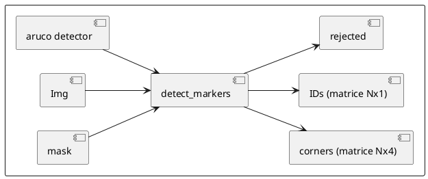
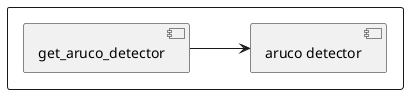
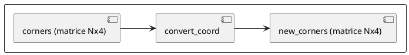
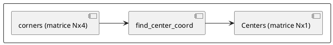
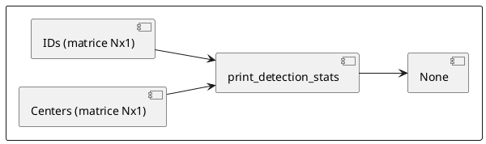
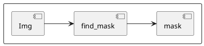
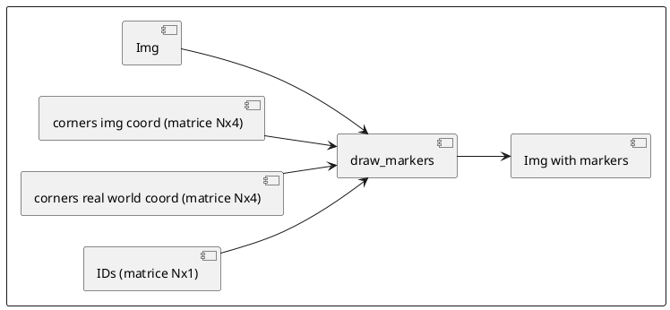

## My functions

**Markers detection**
Find the markers in the input image and return their corners coordinates in the image and IDs.

**Get Aruco Detector**
Create and return an Aruco marker detector with specified parameters.

**Coordinate conversion**
convert the coordinates of the image coordinate system to the terrain coordinate system

**Centers calculation**
Find the center coordinates of each detected marker from their corners coordinates

**Detection statistics**
Print statistics about the detected markers

**Find mask**
Create a mask that hides everything except the playground area

**Annotate image**
(optionnal) Draw the ID of detected markers on the input image
(optionnal) Draw the markers boundaries on the input image
(optionnal) Draw the markers axes on the input image
(optionnal) Draw the markers corners on the input image
(optionnal) Draw the markers coords on the input image

