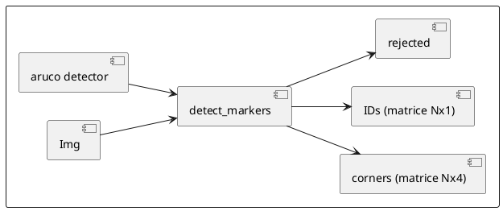

## My functions

**Markers detection**
Find the markers in the input image and return their corners coordinates in the image and IDs.

**Coordinate conversion**
convert the coordinates of the image coordinate system to the terrain coordinate system

**Centers calculation**
Find the center coordinates of each detected marker from their corners coordinates

**Detection statistics**
Print statistics about the detected markers
