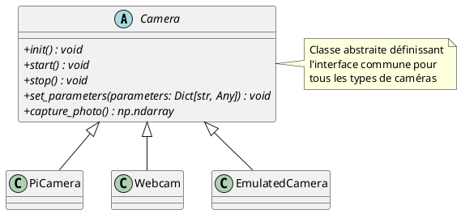

# Module Camera

Ce module fournit une architecture orientée objet pour la gestion de différents types de caméras. Il utilise les principes de la programmation orientée objet (POO) avec une classe abstraite de base et plusieurs implémentations concrètes.

La classe `Camera` définit l'interface commune pour tous les types de caméras. Elle contient les méthodes abstraites suivantes :

#### Méthodes abstraites

- **`init()`** : Initialise le matériel de la caméra
- **`start()`** : Démarre le flux vidéo
- **`stop()`** : Arrête le flux et libère les ressources
- **`set_parameters(parameters: Dict[str, Any])`** : Configure les paramètres de la caméra
- **`capture_photo()`** : Capture une photo et la retourne sous forme de `np.ndarray`

