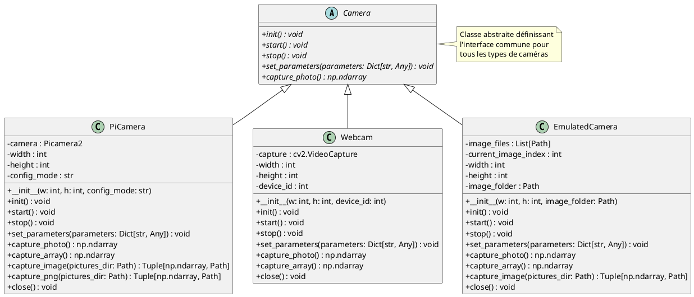

```plantuml
@startuml Camera Architecture

' Configuration du style
skinparam classAttributeIconSize 0
skinparam shadowing false
skinparam backgroundColor white

' ============================================================================
' Diagramme de classes principal
' ============================================================================

abstract class Camera {
    ' Classe abstraite de base pour toutes les caméras
    {abstract} +init() : void
    {abstract} +start() : void
    {abstract} +stop() : void
    {abstract} +set_parameters(parameters: Dict[str, Any]) : void
    {abstract} +capture_photo() : np.ndarray
}

class PiCamera {
    ' Implémentation pour Raspberry Pi
    -camera : Picamera2
    -width : int
    -height : int
    -config_mode : str
    
    +__init__(w: int, h: int, config_mode: str)
    +init() : void
    +start() : void
    +stop() : void
    +set_parameters(parameters: Dict[str, Any]) : void
    +capture_photo() : np.ndarray
    +capture_array() : np.ndarray
    +capture_image(pictures_dir: Path) : Tuple[np.ndarray, Path]
    +capture_png(pictures_dir: Path) : Tuple[np.ndarray, Path]
    +close() : void
}

class Webcam {
    ' Implémentation pour webcams USB
    -capture : cv2.VideoCapture
    -width : int
    -height : int
    -device_id : int
    
    +__init__(w: int, h: int, device_id: int)
    +init() : void
    +start() : void
    +stop() : void
    +set_parameters(parameters: Dict[str, Any]) : void
    +capture_photo() : np.ndarray
    +capture_array() : np.ndarray
    +close() : void
}

class EmulatedCamera {
    ' Implémentation pour simulation/test
    -image_files : List[Path]
    -current_image_index : int
    -width : int
    -height : int
    -image_folder : Path
    
    +__init__(w: int, h: int, image_folder: Path)
    +init() : void
    +start() : void
    +stop() : void
    +set_parameters(parameters: Dict[str, Any]) : void
    +capture_photo() : np.ndarray
    +capture_array() : np.ndarray
    +capture_image(pictures_dir: Path) : Tuple[np.ndarray, Path]
    +close() : void
}

' Relations d'héritage
Camera <|-- PiCamera
Camera <|-- Webcam
Camera <|-- EmulatedCamera

' Note pour la classe Camera
note right of Camera
    Classe abstraite définissant
    l'interface commune pour
    tous les types de caméras
end note

@enduml

@startuml Factory Pattern

' ============================================================================
' Diagramme du Factory Pattern
' ============================================================================

skinparam classAttributeIconSize 0
skinparam shadowing false

class CameraFactory <<factory>> {
    +get_camera(w: int, h: int, camera: CameraMode, camera_param: Any) : Camera
}

abstract class Camera {
    {abstract} +init()
    {abstract} +start()
    {abstract} +stop()
    {abstract} +capture_photo()
}

class PiCamera
class Webcam
class EmulatedCamera

enum CameraMode {
    PI
    COMPUTER
    EMULATED
}

' Relations
CameraFactory ..> Camera : <<creates>>
CameraFactory ..> PiCamera : <<creates>>
CameraFactory ..> Webcam : <<creates>>
CameraFactory ..> EmulatedCamera : <<creates>>
CameraFactory --> CameraMode : <<uses>>

Camera <|-- PiCamera
Camera <|-- Webcam
Camera <|-- EmulatedCamera

note right of CameraFactory
    Factory centralisée pour
    créer des instances de
    caméras selon le type
end note

@enduml

@startuml Dependencies

' ============================================================================
' Diagramme des dépendances
' ============================================================================

skinparam componentStyle rectangle
skinparam shadowing false

package "vision_python.src.camera" {
    [Camera] <<abstract>>
    [PiCamera]
    [Webcam]
    [EmulatedCamera]
    [camera_factory]
}

package "External Libraries" {
    [picamera2.Picamera2]
    [cv2.VideoCapture]
    [cv2.imread]
}

package "Standard Libraries" {
    [pathlib.Path]
    [numpy.ndarray]
    [logging]
}

' Relations d'héritage
[Camera] <|-- [PiCamera]
[Camera] <|-- [Webcam]
[Camera] <|-- [EmulatedCamera]

' Dépendances vers bibliothèques externes
[PiCamera] --> [picamera2.Picamera2] : uses
[Webcam] --> [cv2.VideoCapture] : uses
[EmulatedCamera] --> [cv2.imread] : uses

' Dépendances de la factory
[camera_factory] ..> [Camera] : creates
[camera_factory] ..> [PiCamera] : creates
[camera_factory] ..> [Webcam] : creates
[camera_factory] ..> [EmulatedCamera] : creates

' Dépendances vers bibliothèques standard
[Camera] --> [numpy.ndarray] : returns
[Camera] --> [pathlib.Path] : uses
[PiCamera] --> [logging] : uses
[Webcam] --> [logging] : uses
[EmulatedCamera] --> [logging] : uses

@enduml

@startuml Sequence - Factory Usage

' ============================================================================
' Diagramme de séquence - Utilisation avec Factory
' ============================================================================

skinparam shadowing false

actor "Client Code" as Client
participant "camera_factory" as Factory
participant "Camera\n(PiCamera/Webcam/\nEmulatedCamera)" as Camera

Client -> Factory : get_camera(w, h, mode, param)
activate Factory

Factory -> Camera : __init__(w, h, ...)
activate Camera
Camera -> Camera : init()
Camera --> Factory : camera instance
deactivate Camera

Factory --> Client : camera
deactivate Factory

Client -> Camera : start()
activate Camera
Camera --> Client : 
deactivate Camera

Client -> Camera : set_parameters(params)
activate Camera
Camera --> Client : 
deactivate Camera

loop for each photo
    Client -> Camera : capture_photo()
    activate Camera
    Camera --> Client : np.ndarray (image)
    deactivate Camera
end

Client -> Camera : stop()
activate Camera
Camera --> Client : 
deactivate Camera

@enduml

@startuml Sequence - Direct Instantiation

' ============================================================================
' Diagramme de séquence - Instanciation directe
' ============================================================================

skinparam shadowing false

actor "Client Code" as Client
participant "PiCamera" as Pi
participant "Picamera2" as Hardware

Client -> Pi : PiCamera(w=1920, h=1080, mode="still")
activate Pi

Pi -> Pi : init()
activate Pi
Pi -> Hardware : Picamera2()
activate Hardware
Hardware --> Pi : camera
deactivate Hardware

Pi -> Hardware : create_still_configuration(size)
activate Hardware
Hardware --> Pi : config
deactivate Hardware

Pi -> Hardware : configure(config)
activate Hardware
Hardware --> Pi : 
deactivate Hardware

deactivate Pi
Pi --> Client : camera instance
deactivate Pi

Client -> Pi : start()
activate Pi
Pi -> Hardware : start()
activate Hardware
Hardware --> Pi : 
deactivate Hardware
Pi --> Client : 
deactivate Pi

Client -> Pi : capture_photo()
activate Pi
Pi -> Hardware : capture_array()
activate Hardware
Hardware --> Pi : image (RGB)
deactivate Hardware
Pi --> Client : np.ndarray
deactivate Pi

Client -> Pi : stop()
activate Pi
Pi -> Hardware : stop()
activate Hardware
Hardware --> Pi : 
deactivate Hardware
Pi -> Hardware : close()
activate Hardware
Hardware --> Pi : 
deactivate Hardware
Pi --> Client : 
deactivate Pi

@enduml

@startuml Use Case Diagram

' ============================================================================
' Diagramme de cas d'utilisation
' ============================================================================

skinparam shadowing false

left to right direction

actor Developer as dev
actor "Raspberry Pi" as pi
actor "USB Webcam" as usb
actor "Test Environment" as test

rectangle "Camera Module" {
    usecase "Initialize Camera" as UC1
    usecase "Start Video Stream" as UC2
    usecase "Capture Photo" as UC3
    usecase "Configure Parameters" as UC4
    usecase "Stop Camera" as UC5
    usecase "Use Factory" as UC6
}

dev --> UC1
dev --> UC2
dev --> UC3
dev --> UC4
dev --> UC5
dev --> UC6

UC1 ..> pi : <<PiCamera>>
UC1 ..> usb : <<Webcam>>
UC1 ..> test : <<EmulatedCamera>>

UC2 --> UC3 : <<includes>>
UC3 --> UC5 : <<includes>>

note right of UC6
    Factory Pattern permet
    de créer n'importe quel
    type de caméra facilement
end note

@enduml

@startuml State Diagram

' ============================================================================
' Diagramme d'états d'une caméra
' ============================================================================

skinparam shadowing false

[*] --> NotInitialized

NotInitialized --> Initialized : init()
Initialized --> Running : start()
Running --> Running : capture_photo()
Running --> Running : set_parameters()
Running --> Stopped : stop()
Stopped --> [*]

note right of Running
    La caméra est active
    et peut capturer des photos
end note

note right of Initialized
    La caméra est configurée
    mais pas encore démarrée
end note

@enduml

@startuml Component Diagram

' ============================================================================
' Diagramme de composants
' ============================================================================

skinparam componentStyle rectangle
skinparam shadowing false

package "Camera Module" {
    component [camera.py] as camera {
        [Camera ABC]
        [PiCamera]
    }
    
    component [webcam.py] as webcam {
        [Webcam]
    }
    
    component [emulated_camera.py] as emulated {
        [EmulatedCamera]
    }
    
    component [camera_factory.py] as factory {
        [get_camera()]
    }
    
    component [__init__.py] as init {
        [Module exports]
    }
}

package "External Dependencies" {
    component [picamera2]
    component [OpenCV]
}

package "Configuration" {
    component [config.py] {
        [CameraMode enum]
    }
}

' Relations
[factory] --> [Camera ABC] : imports
[factory] --> [PiCamera] : imports
[factory] --> [Webcam] : imports
[factory] --> [EmulatedCamera] : imports
[factory] --> [CameraMode enum] : imports

[init] --> [camera] : exports
[init] --> [webcam] : exports
[init] --> [emulated] : exports
[init] --> [factory] : exports

[PiCamera] --> [picamera2] : depends on
[Webcam] --> [OpenCV] : depends on
[EmulatedCamera] --> [OpenCV] : depends on

note right of [Camera ABC]
    Classe abstraite de base
    définissant l'interface
end note

@enduml

@startuml Polymorphism Example

' ============================================================================
' Diagramme illustrant le polymorphisme
' ============================================================================

skinparam shadowing false

class Client {
    +process_camera(camera: Camera)
}

abstract class Camera {
    {abstract} +capture_photo() : np.ndarray
}

class PiCamera {
    +capture_photo() : np.ndarray
}

class Webcam {
    +capture_photo() : np.ndarray
}

class EmulatedCamera {
    +capture_photo() : np.ndarray
}

Client --> Camera : uses
Camera <|-- PiCamera
Camera <|-- Webcam
Camera <|-- EmulatedCamera

note bottom of Client
    Le client peut travailler avec
    n'importe quelle implémentation
    de Camera grâce au polymorphisme
end note

note bottom of Camera
    Toutes les sous-classes
    implémentent capture_photo()
    de manière spécifique
end note

@enduml

@startuml Package Diagram

' ============================================================================
' Diagramme de packages
' ============================================================================

skinparam packageStyle rectangle
skinparam shadowing false

package "vision_python" {
    package "src" {
        package "camera" {
            class Camera
            class PiCamera
            class Webcam
            class EmulatedCamera
            class camera_factory
        }
        
        package "aruco" {
        }
        
        package "img_processing" {
        }
        
        package "playground" {
        }
    }
    
    package "config" {
        class CameraMode
        class config
    }
    
    package "tests" {
    }
}

camera --> config : imports
tests ..> camera : tests

note right of camera
    Module principal contenant
    toute la hiérarchie de classes
    pour la gestion des caméras
end note

@enduml
```